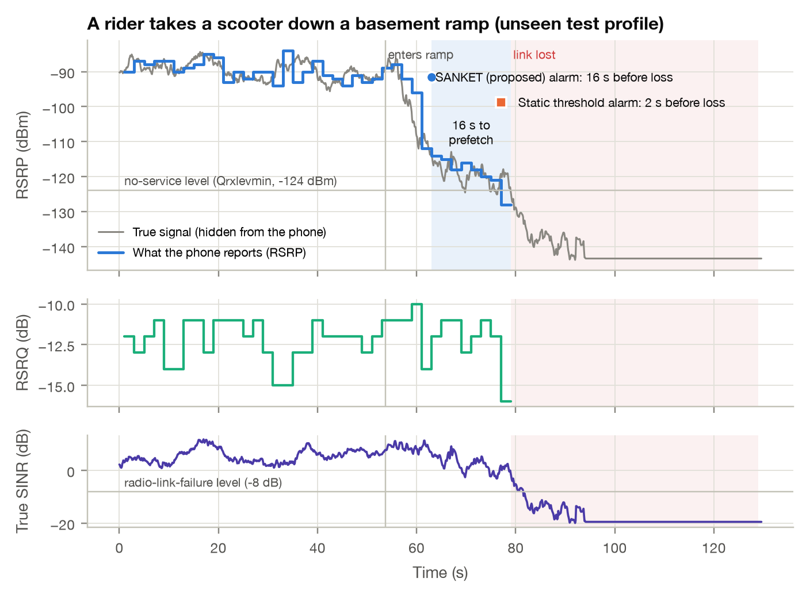

# SANKET: predicting cellular link loss before a delivery rider goes underground

PRAYAS problem **PRAYAS-COMP-26-S-020** (Computer Engineering, Terna Engineering College; mentor Dr. Rohini Palve).

This folder holds the research study submitted to PRAYAS. The Android app built on it is in [`../app`](../app),
and every feature is listed in [`../FEATURES.md`](../FEATURES.md).

Delivery riders lose LTE within seconds of entering a basement or a concrete cloud-kitchen hub, and the app
fails mid-order. SANKET (संकेत, "early sign") watches the phone's own RSRP and RSRQ readings and tells the app
to download the order data before the link breaks.

## How it works

1. **Clean the readings.** Android reports whole-dB values and refreshes them only every 2 to 3 s; about 60% of
   1-second readings are stale repeats. A stream adapter turns them back into real measurement events.
2. **Track the trend.** A Kalman filter (local linear trend) estimates the signal level and its rate of fall in
   dB/s, the temporal gradient, together with its uncertainty.
3. **Forecast the risk.** If the probability that RSRP will be at or below the no-service level (−124 dBm, the 3GPP
   cell-selection threshold) 10 s from now is at least 70%, and the signal falls by 1 dB/s or more, the phone prefetches.
4. **Check the neighbours.** Inside concrete every cell fades together. If a neighbour cell holds steady, the fall
   is a handover zone or street shadow, and the alarm is cancelled.
5. **Remember dead zones.** After a loss, the phone reports the entrance location. Once two trips confirm a zone,
   riders approaching it get the prefetch before the signal moves.

## Results (unseen test data; numbers from `results/RESULTS.md`)

| | SANKET | Static threshold |
|---|---|---|
| Entries warned at least 10 s ahead | **43.8%** | 10.2% |
| False alarms per hour on real rides | 1.76 | 0.98 |
| Critical order data saved before the loss | **80.2%** | 46.4% |

- Only 81% of entries leave 10 s between the entrance and the loss, so a signal-only predictor cannot reach 85%
  at 10 s.
- The critical data needs only 3 s of warning; offline map tiles need 10 s.
- With dead-zone memory, warning of at least 10 s reaches 76% on day 1 and 95% by day 7.



## Method in one paragraph

52.4 h of public LTE drive-test traces (UCC dataset) set the noise, staleness and background behaviour. A physics
simulator, calibrated to those traces, generates basement entries and look-alikes. Ground truth follows 3GPP
radio-link failure and cell-selection rules. Five detectors (static threshold, naive gradient, regression slope,
logistic regression, SANKET) are tuned on calibration data under the same false-alarm budget and tested once on
unseen data: simulated entries, real rides, and real recordings with an entry added. A prefetch model derives
how much warning each part of the order data needs.

## Run it

From this `research/` folder:

```
./setup.sh                                                 # creates .venv, installs pinned packages, runs tests
./.venv/bin/python live/sanket_live.py --demo --speed 4    # terminal demo
open web/SANKET_dashboard.html                             # interactive demo, offline
./.venv/bin/python experiments/run_all.py --reuse-params   # reproduce all numbers and figures (~2 min)
```

The PRAYAS write-up (PDF, filled Word template and portal text) is built from `results/metrics.json` by
`submission/build_submission.py`; copy `submission/team.example.json` to `submission/team.json` first.

## Layout

`sanket/` research code (the detector is `core.py`, standard library only) · `experiments/` the pipeline ·
`tests/` automated tests · `results/` metrics, tables, figures · `web/` dashboard and JavaScript port ·
`android/` Java port and integration guide · `live/` phone tool · `submission/` PRAYAS write-up and builder.

## Data and credits

UCC 4G LTE dataset: D. Raca, J. J. Quinlan, A. H. Zahran, C. J. Sreenan, "Beyond Throughput: a 4G LTE Dataset with
Channel and Context Metrics", ACM MMSys 2018, doi:10.5281/zenodo.1219679, CC BY 4.0. Building-entry losses:
arXiv:2605.23483. Throughput model: 3GPP TR 36.942 A.1. AI assistance: Claude (Anthropic) and Gemini, as stated
in the submission.
